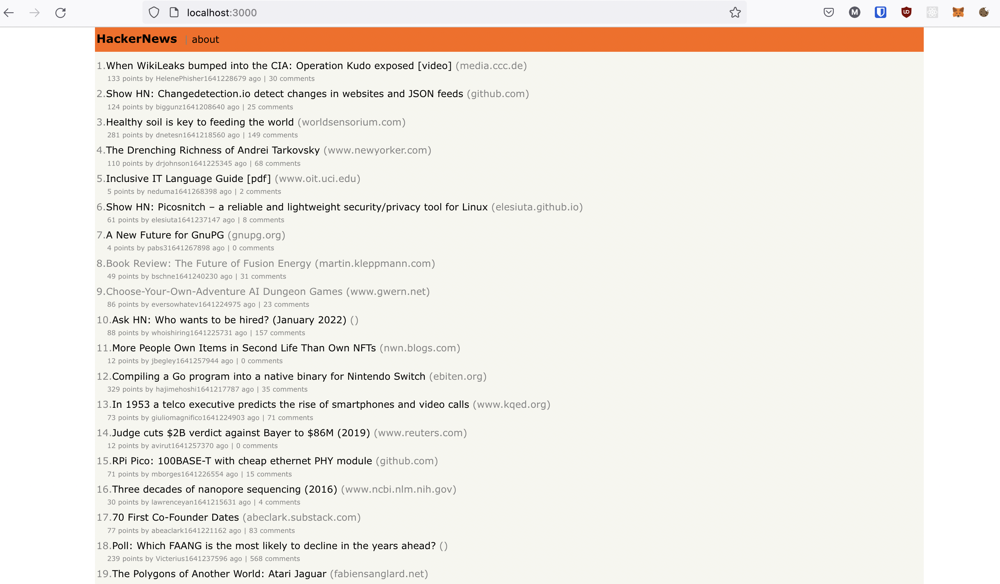

# Hacker News Clone

HackerNews clone written in Kotlin, SpringBoot and VueJS.



## Getting Started

Build and run the backend
````
mvn clean install
mvn spring-boot:run
````

Run the frontend
``` 
cd frontend
npm install
npm run serve -- --port 3000
```

Navigate to `http://localhost:3000` in your browser